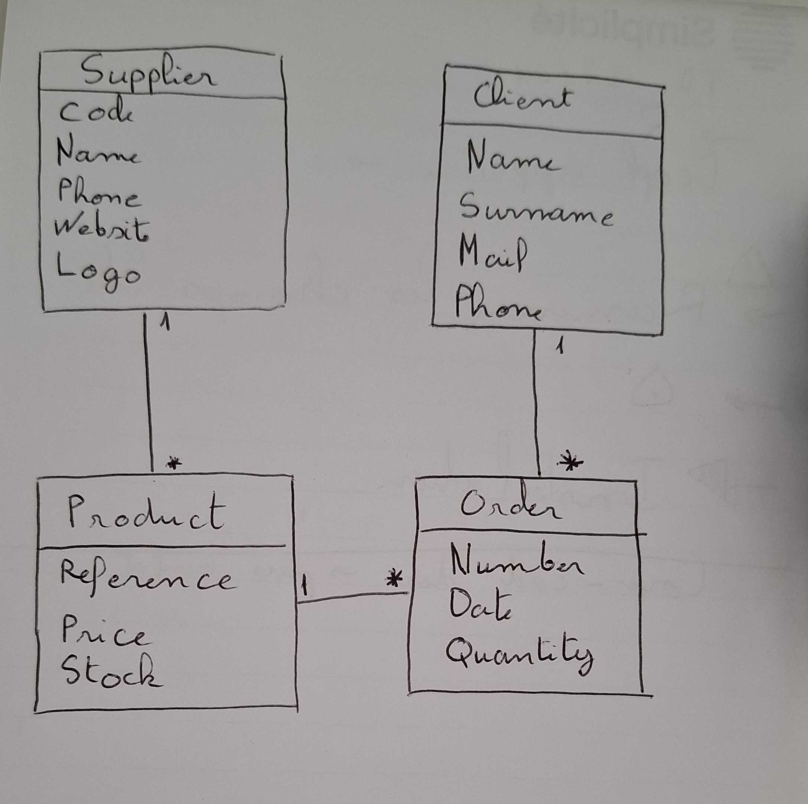
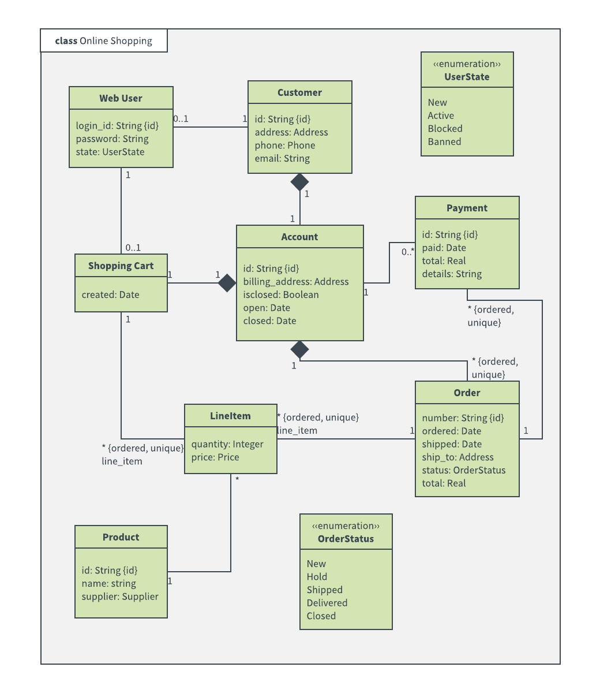

# Introduction

This document provides various prompt examples for the different available AI assistants.

---

## Module Generation

Use AI to co-create or update a module based on your business needs. This feature is available in the **AI assistant** domain.

<details>
  <summary>Scenario 1: Hand-Drawn UML of the Training Module</summary>
  
  
  
  This example shows a hand-drawn UML diagram representing a training module. It includes basic elements such as classes and relationships.

</details>

<details>
  <summary>Scenario 2: Complex UML for an Order Management Application</summary>
  
  
  
  This UML diagram illustrates a more complex application, specifically an order management system.

</details>

<details>
  <summary>Scenario 3: Detailed Business Prompt </summary>  

  Develop a module for a library management system to streamline book and patron management. The module should be object-oriented and include:

  1. **Book Management**: Track book details, including titles, authors, genres, and availability.
  2. **Patron Management**: Manage patron information, including contact details and borrowing history.
  3. **Check-Out/Check-In**: Facilitate the check-out and check-in process for books.
  4. **Reservation System**: Allow patrons to reserve books and view their current reservations.
  5. **Reporting**: Generate basic reports on book inventory, overdue items, and patron activity.

</details>

<details>
  <summary>Scenario 4: Adding a Cart Class to the Existing Training Module</summary>
  
  Use the module from Scenario 1 as the base. You will automatically retrieve the existing module's details. Request the addition of a new class called `Cart` with the following attributes:

  **Prompt:**

```
  Please add a `Cart`. The `Cart` class should have:

  - **Attributes**:
    - `cartID` (String)
    - `creationDate` (Date)
    - `items` (List of Item)
```

</details>

---

## Data Generation

Use AI to generate test data for a module. This feature is also available in the **AI assistant** domain.

---

## Business Chatbot

A shortcut to a chatbot contextualized according to the form on which it is opened. The user must have `AI_BUSINESS` rights. The `Personal data`, `Confidential data`, and `Intimate` fields are not sent to the AI.

### On Demo objects: 

<details>
  <summary>Example 1: Supplier</summary>
  
  **Prompt:**

  `Could you provide me with an invitation email for our upcoming product presentation event?`
  
  **Explanation:**  
  
  This prompt requests the chatbot to generate an invitation email for an event, contextualized to a supplier.

</details>

<details>
  <summary>Example 2: Product</summary>
  
  **Prompt:**

  `Could you draft a stock order email to the supplier?`
  
  **Explanation:**  
  
  This prompt asks the chatbot to create a formal email for ordering stock from a supplier. 

</details>

<details>
  <summary>Example 3: Customers</summary>
  
  **Prompt:**

  `Can you help me draft an email informing a customer of a special promo code for their loyalty?`
  
  **Explanation:**  
  
  This prompt asks the chatbot to create an email that informs a customer about a special promo code they can use as a reward for their loyalty.

</details>

<details>
  <summary>Example 4: Order</summary>
  
  **Prompt:**

  `Could you generate an order confirmation email for a recent purchase?`
  
  **Explanation:**  
  
  This prompt requests the chatbot to draft an order confirmation email for a purchase. 

</details>

<details>
  <summary>Example 5: Order</summary>
  
  **Prompt:**

  `Can you provide a summary of this order?`
  
  **Explanation:**  
  
  This prompt asks the chatbot to give a brief overview of the details related to a specific order.


</details>

---

## Metrics

Generate AI graphs on a module's data. In a `view`, add an `external page` with source `External object`: `AIMetricsChat?module=<your_module_name>`


## Metrics

Generate AI graphs on a module's data. In a `view`, add an `external page` with source `External object`: `AIMetricsChat?module=<your_module_name>`


### With Demo AI Addon in AI Assistant in Demo domain:

<details>
  <summary>Example 1: Monthly Orders Overview</summary>
  
  **Prompt:**

  `Generate a graph showing the total number of orders placed each month for the past year.`

  **Summary:**

  This prompt requests a monthly breakdown of the total number of orders placed over the past year to track trends and seasonal variations.

</details>

<details>
  <summary>Example 2: Top Products Stock Levels</summary>
  
  **Prompt:**

  `Create a graph showing the current stock levels of products.`

  **Summary:**

  This prompt asks for a graph illustrating the stock levels of products, focusing on the current inventory quantities.

</details>


<details>
  <summary>Example 3: Supplier Product Distribution</summary>
  
  **Prompt:**

  `Generate a pie chart showing the percentage of products provided by each supplier.`

  **Summary:**

  This prompt requests a pie chart that shows the distribution of products across different suppliers, highlighting each supplier's contribution to the total product inventory.

</details>

<details>
  <summary>Example 4: Order Status Distribution</summary>
  
  **Prompt:**

  `Create a graph showing the distribution of order statuses (e.g., Completed, Pending, Shipped) for the current quarter. Include the count of orders for each status.`

  **Summary:**

  This prompt asks for a graph that displays the number of orders for each status (Completed, Pending, Shipped) for the current quarter, providing insight into the current order processing state.

</details>

---
