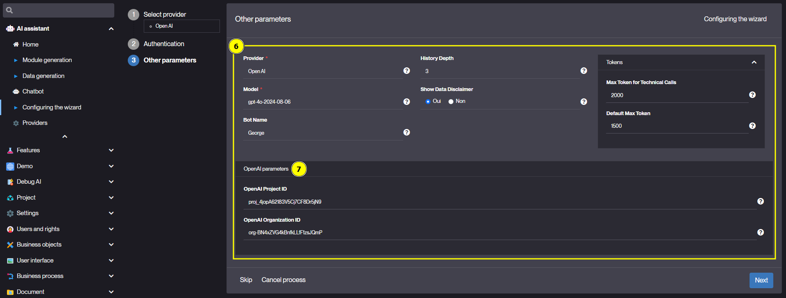
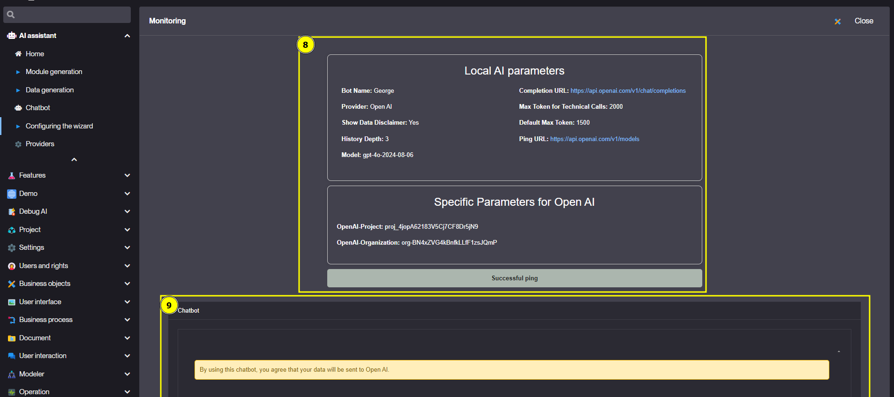
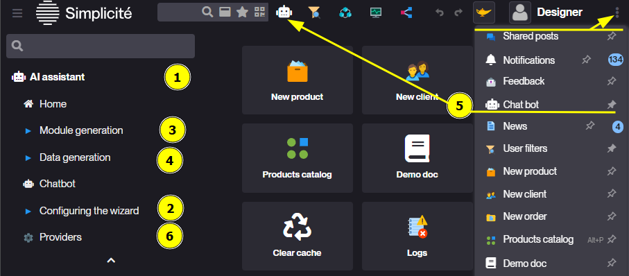
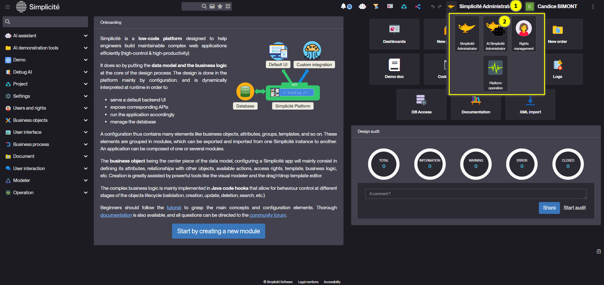
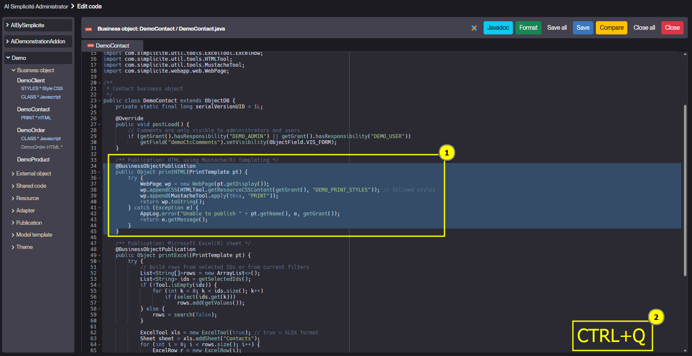
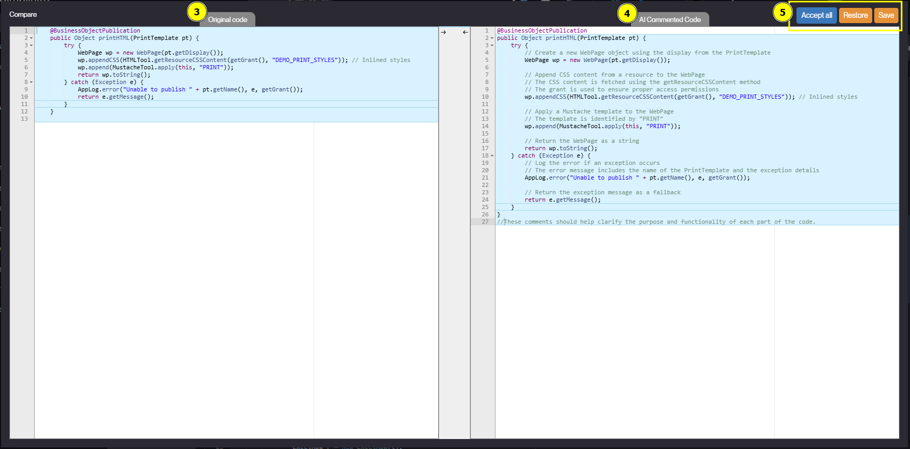
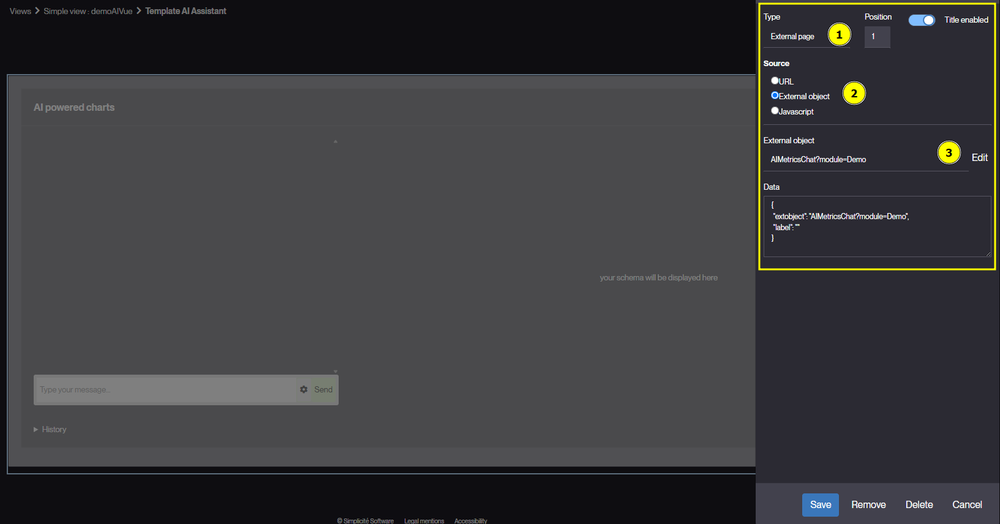

<!--
 ___ _            _ _    _ _    __
/ __(_)_ __  _ __| (_)__(_) |_ /_/
\__ \ | '  \| '_ \ | / _| |  _/ -_)
|___/_|_|_|_| .__/_|_\__|_|\__\___|
            |_| 
-->

* * *

`AIBySimplicite` module definition
==================================

### Introduction
Exploratory module on the use of AI in Simplicite

---

### Import
To import this module, you have two options:

#### Option 1: Git Repository

1. Create a module named `AIBySimplicite`.
2. Set the settings as:
```json
{
	"origin": {
		"uri": "https://github.com/simplicitesoftware/module_ai.git"
	},
	"type": "git",
	"branch": "<6 or 6.1>"
}
```
3. Click on the Import module button.

#### Option 2: App Store

1. Navigate to the App Store in the Project domain.
2. Go to the Tools tab.
3. Select "AI integrations" from the list.
4. Follow the on-screen instructions to import the module.

---

### Configure
To configure the AI connection, utilize the `configuring the wizard` process in the `AI assistant` domain in extended mode.

Select the model (LLM) you wish to use, configure the API key, and the URL of your API:
|Process steps||
|---|---|
||1. Domain AI<br>2. Configuration process<br>3. Select the LLM you will use|
||4. Set your API key<br>5. If you use a dedied api set the endpoint of your API|
||See help for details<br>6. parametres<br>7. Depends of your LLM |
||8. recap of setup and ping result<br>9. you can test the chatbot|


**Follow the process:**

After configuring, you will obtain the details of your now active configuration. This summary is available on the homepage of the domain.

<details>
  <summary>Parameters details</summary>

##### hist_depth
Defines the number of messages in the history used for the context. The greater this number, the more tokens the request uses, but the more relevant is the response.

##### max_token
*optional*  
Limits the number of tokens in the AI response.

###### default_max_token
Maximum number of tokens in a usual context.

###### code_max_token
Maximum number of tokens for technical calls.

</details>

---

### Wizard



1. AI domain
1. [LLM and API configuration](#configure)
1. [AI-assisted module creation or completion process](#module-generation)
1. [Enhanced Code Editor](#enhanced-code-editor)
1. [Data generation process](#data-generation)
1. [Chatbot for Business with context](#business-chatbot)
1. List of LLMs currently configurable. 

#### Module generation
Use AI to co-create or update a module based on your business needs
`Module generation` in `AI assistant` domain.

#### Data generation
Use AI to generate test data for a module.
`Data generation` in `AI assistant` domain.
#### Enhanced Code Editor
For AI enhanced code editor, you have to use `Code editor`in the `AI enhanced simplicite` disposition.


1. Open the scope selector.
2. Select the `AI Simplicité Administrator` scope.
3. Go to the `Code editor`.

##### Comment code
A Keyboard shortcut is available to comment on a file or a block of code with AI:


1. Select the code you want to comment; nothing for the whole file.
2. Press `Ctrl+Q`
3. The old code.
4. AI suggested commentary
5. Use ace editor obtion to accept part of the commentary or all. Then use the option to close the commentator.
	1. Accept all: accept all the commentary (`AI commented code` part).
	2. Restore: restore the original code (do not save the commentary).
	3. Save: save the manual check commentary (`Original code` part).

#### Business chatbot
A shortcut to a chatbot contextualized according to the form on which it is opened.
The user must have `AI_BUSINESS` rights.
The `Personal data`, `Confidential data` and `Intimate` fields are not sent to the AI.

##### Add ui context to chatbot
The chatbot can be contextualized to the current user's scope, including knowledge of the UI and business rules. To achieve you have to pregenerate the ui and rules description:
* Open the settings of the scope to which you want to add a context (in the User interface => views => Home page submenu).
* Go to the tab of the link with `Group gui description`.
* Create a new `Group gui description` by choosing the desired language.
* You can refine the description by selecting the groups to be considered for this description (by default, the groups of rights in the scope are taken into account).


1. The chatbot open in this scope will have UI context
2. The lang (to get context in the user language)
3. Auto generated Description of the ui and the rules
4. The descritpion will contaigne all visible domaine and object for the listed groupe with GUIDescription has yes

**Important: remember to regenerate this description when there are changes to the rights and rules of your objects**

#### Metrics
Generating AI graphs on a module's data
In a `view` add an `external page` (1) of source `External object` (2): `AIMetricsChat?module=<you_module_name>` (3)

For detailed examples on how to generate modules, interact with business chatbots, and visualize metrics, please refer to the example available at the following link:
[Explore AI Assistant Prompt Examples](https://github.com/simplicitesoftware/module_ai/blob/51425242c08e8f224ecc8d15ebcd80ca8b205d4c/EXAMPLE.md)
